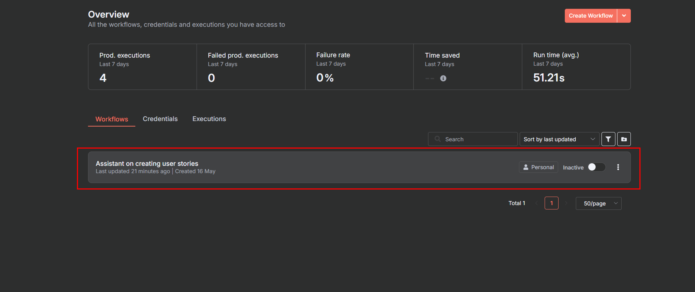
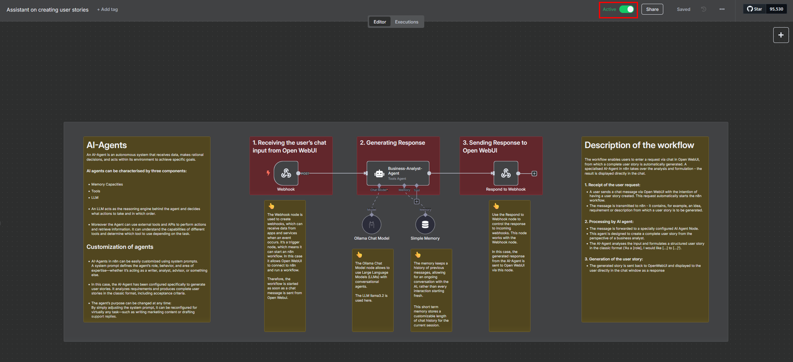
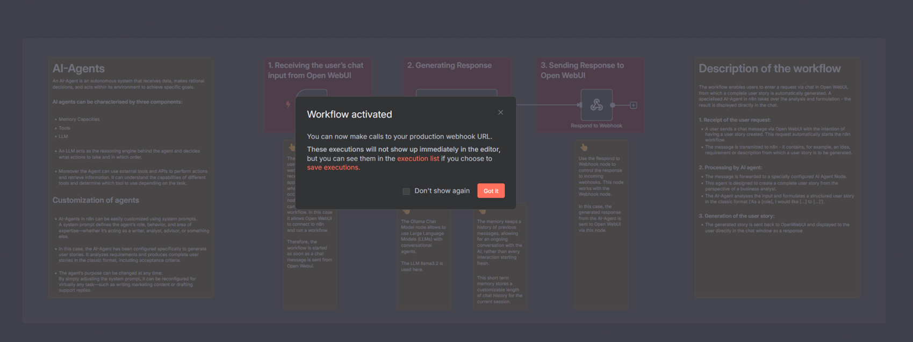
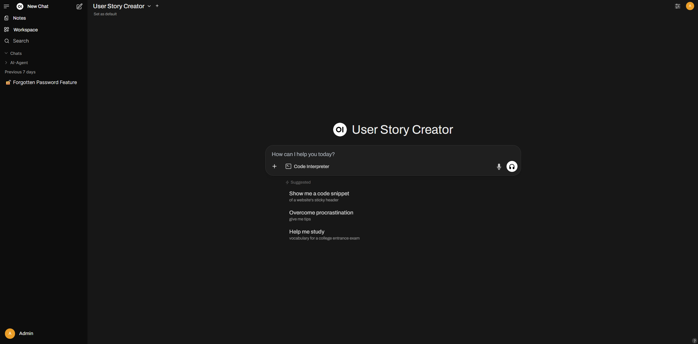

# AI-Agent-Garage

## Description
This project is a generic AI-Agent Toolset to build n8n-workflows that can be triggered by OpenWebUI. It contains a self-hosted AI User Story Assistant and is an open-source, multi-container setup that integrates OpenWebUI, n8n, and a dedicated AI-Agent to automatically generate structured user stories from natural language chat input.

The AI-Agent-Garage is based on the [**Self-hosted AI starter kit**](https://github.com/n8n-io/self-hosted-ai-starter-kit)

### Purpose
The purpose of this project is to provide a beginner-friendly multi-container system that demonstrates how AI-Agents can be integrated and used with the help of open source or freely accessible technologies. The objective is to create an accessible platform that enables even less technically interested users to experiment with AI-Agents and experience how they work in a practical way - without complex setup or in-depth prior knowledge.

### What’s included

✅ [**Self-hosted n8n**](https://n8n.io/) - Low-code platform with over 400
integrations and advanced AI components. In this case n8n is used for the automation logic (with separate import container n8n-import)

✅ [**Ollama**](https://ollama.com/) - Cross-platform LLM platform to install
and run the latest local LLMs. 

 Here, ollama-cpu, ollama-gpu and ollama-gpu-amd serve as LLM inference servers that provide locally pre-trained language models and efficiently process requests from the AI agent - depending on the available hardware (CPU or GPU).

✅ [**PostgreSQL**](https://www.postgresql.org/) -  Workhorse of the Data
Engineering world, handles large amounts of data safely. In this case it works as as a database for n8n

✅ [**Open WebUI**](https://docs.openwebui.com/) -  User-friendly chat frontend for AI interaction

✅ **ollama-pull-llama** -  Initialisation containers that download the required Large Language Model and load it into the persistent memory at the first start.

✅ **n8n-import** -  setup container that automatically imports previously exported workflows and credentials into n8n the first time it is started. This means the system is immediately ready for use.


## Installation

### Cloning the Repository

```bash
git clone https://github.com/twodigits-genai/agent-garage
cd  agent-garage
```

### Running the multi container system

> A container engine is required to run this multi-container system. Either Docker or Podman can be used. One of these must be selected prior to installation, as it serves as the foundational component for hosting the containers.

#### For Nvidia GPU users

##### Docker:

```
docker compose --profile gpu-nvidia --file compose.yml up
```

##### Podman:

```
podman compose --profile gpu-nvidia --file compose.yml up
```

> [!NOTE]
> If you have not used your Nvidia GPU with Docker before, please follow the
> [Ollama Docker instructions](https://github.com/ollama/ollama/blob/main/docs/docker.md).

#### For AMD GPU users on Linux

##### Docker:

```
docker compose --profile gpu-amd --file compose.yml up
```

##### Podman:

```
podman compose --profile gpu-amd --file compose.yml up
```

#### For Mac / Apple Silicon users

If you’re using a Mac with an M1 or newer processor, you can't expose your GPU
to the Docker instance, unfortunately. There are two options in this case:

1. Run the multi-container-system fully on CPU, like in the section "For everyone else"
   below
2. Run Ollama on your Mac for faster inference, and connect to that from the
   n8n instance


##### Docker:

```
docker compose --file compose.yml up
```

##### Podman:

```
podman compose --file compose.yml up
```

#### For everyone else

##### Docker:

```
docker compose --profile cpu --file compose.yml up
```

##### Podman:

```
podman compose --profile cpu --file compose.yml up
```


## ⚡️ Quick start and usage

### n8n

1. Navigate to http://localhost:5678
2. The Registration form will appear.
3. Enter the requested data. However, these do not have to be valid, as the e-mail address is not checked. You only have to set this up once.

   


4. The dashboard will be loaded.
5. Open the included workflow "Assistant on creating user stories" via http://localhost:5678/workflow/5g3wIBt23oVl7EOC or by double-clicking on it.

   

6. Before the workflow can be tried out, the workflow must be activated by clicking on the “Active” button in the top right-hand corner.

   
   

7. The workflow is then ready for use. The agent can easily be used for many other tasks by customizing the system prompt. The workflow's functionality can be understood through the explanations in the workflow.


### Open WebUI

1. Navigate to http://localhost:8080

### Attention:
 Open WebUI is already configured. It may take a few minutes for the configuration data to finish loading. Open WebUI should only be started in the browser once the status message 200 has been displayed as shown below:

   

When starting http://localhost:8080 the Sign In appears: 

   

2. Use the following credentials to sign in:

   Email: admin@test.com

   Password: S2yjzup!3

3. After login, the chat interface is visible.


   


4. Start Chatting! The chat interface is ready for use. Requests regarding user stories can be sent and then the AI-Agent's response is generated and finally displayed in the chat interface of Open WebUI.


## 💡 Notes

1. The llama 3.2 model is installed in the system as standard. Alternatively, it is possible to use different LLMs. The exchange is carried out simply by adapting the model name in the compose.yml file:


   

To be able to use the new LLM, all containers must be shut down and removed. The setup can then be restarted:

##### Docker:

```
docker compose --file compose.yml down
docker rm --all
```

##### Podman:

```
podman compose --file compose.yml down
podman rm --all
```

2. #### Disclaimer: 
   Please note that Open WebUI is still under active development and is intended for experimentation and testing only. It is not recommended for production use. As a result, you may occasionally experience display delays within the Open WebUI interface. In this case, reloading the page or waiting a few seconds will usually solve the problem.