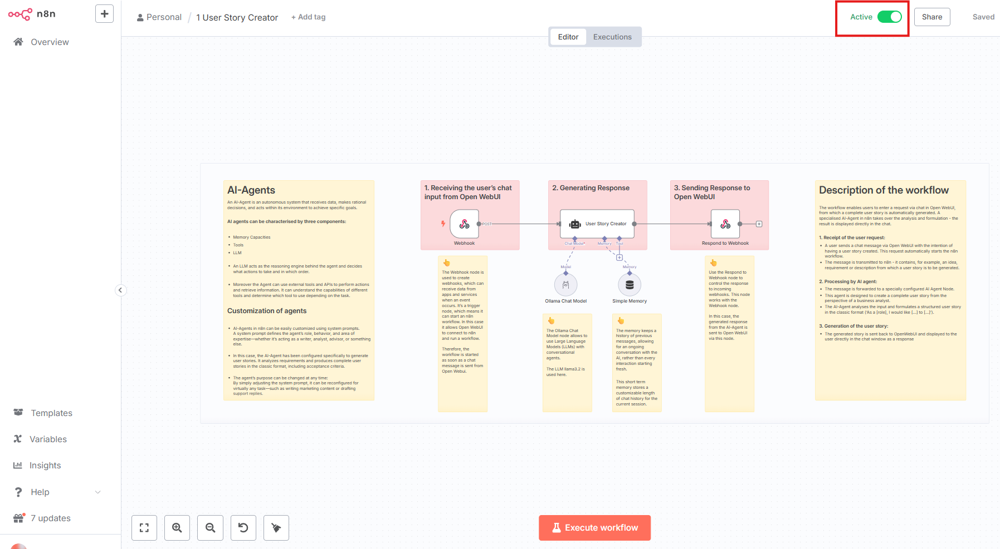

# Agent Garage: A GenAI Reference Architecture 
**Agent Garage** is an open-source project aimed at building a reference architecture for a generative AI (GenAI) platform using open-source software. It is designed to serve as a starting point for creating agentic AI workflows and exploring modular, self-hosted AI solutions.
This project builds upon the foundation of the **Self-hosted AI Starter Kit**, curated by <https://github.com/n8n-io>, which combines the self-hosted n8n platform with a curated list of compatible AI products and components.
> [!NOTE]
> **Work in Progress:** Agent Garage is in its early stages of development. Contributions and feedback are welcome as the project evolves.
### Key Features
🚗 **Agentic AI:** Build smart, autonomous agents effortlessly.
🧰 **Full-Stack:** Frontend, backend, databases and local LLM covered.
🛠️ **Modular:** Easily customizable, swap tools in and out.
📖 **Documentation & Demos:** Practical examples and docs to learn and accelerate client showcases.
🌐 **Open Source First:** 100% open-source tools, ready for enterprise adoption.

### OpenSource Tech-Stack
✅ [**Open WebUI**](https://openwebui.com/) -  User-friendly AI Interface.
✅ [**Self-hosted n8n**](https://n8n.io/) - Low-code platform with over 400
integrations and advanced AI components
✅ [**Ollama**](https://ollama.com/) - Cross-platform LLM platform to install
and run the latest local LLMs
✅ [**Qdrant**](https://qdrant.tech/) - Open-source, high performance vector
store with an comprehensive API
✅ [**PostgreSQL**](https://www.postgresql.org/) -  Workhorse of the Data
Engineering world, handles large amounts of data safely.

## Installation

### Cloning the Repository

```bash
git clone https://github.com/twodigits-genai/agent-garage.git
cd agent-garage
```

### Running the multi container system

> A container engine is required to run this multi-container system. Either Docker or Podman can be used. One of these must be selected prior to installation, as it serves as the foundational component for hosting the containers.

### Running n8n using Docker Compose
 
#### For Nvidia GPU users
 
```
git clone https://github.com/twodigits-genai/agent-garage.git
cd agent-garage
docker compose --profile gpu-nvidia up
```
> [!NOTE]
> If you have not used your Nvidia GPU with Docker before, please follow the
> [Ollama Docker instructions](https://github.com/ollama/ollama/blob/main/docs/docker.md).
### For AMD GPU users on Linux
```
git clone https://github.com/twodigits-genai/agent-garage.git
cd agent-garage
docker compose --profile gpu-amd up
```
#### For Mac / Apple Silicon users
If you’re using a Mac with an M1 or newer processor, you can't expose your GPU
to the Docker instance, unfortunately. There are two options in this case:
1. Run the starter kit fully on CPU, like in the section "For everyone else"
   below
2. Run Ollama on your Mac for faster inference, and connect to that from the
   n8n instance
If you want to run Ollama on your mac, check the
[Ollama homepage](https://ollama.com/)
for installation instructions, and run the starter kit as follows:
```
git clone https://github.com/twodigits-genai/agent-garage.git
cd agent-garage
docker compose up
```
##### For Mac users running OLLAMA locally
If you're running OLLAMA locally on your Mac (not in Docker), you need to modify the OLLAMA_HOST environment variable
in the n8n service configuration. Update the x-n8n section in your Docker Compose file as follows:
```yaml
x-n8n: &service-n8n
  # ... other configurations ...
  environment:
    # ... other environment variables ...
    - OLLAMA_HOST=host.docker.internal:11434
```
Additionally, after you see "Editor is now accessible via: <http://localhost:5678/>":
1. Head to <http://localhost:5678/home/credentials>
2. Click on "Local Ollama service"
3. Change the base URL to "http://host.docker.internal:11434/"
#### For everyone else
```
git clone https://github.com/twodigits-genai/agent-garage.git
cd agent-garage
docker compose --profile cpu up
```

### Running n8n using Podman:

#### For Nvidia GPU users
```
podman compose --profile gpu-nvidia --file docker-compose.yml up
```

#### For AMD GPU users on Linux

```
podman compose --profile gpu-amd --file docker-compose.yml up
```

#### For Mac / Apple Silicon users

If you’re using a Mac with an M1 or newer processor, you can't expose your GPU
to the Docker instance, unfortunately. There are two options in this case:

1. Run the multi-container-system fully on CPU, like in the section "For everyone else"
   below
2. Run Ollama on your Mac for faster inference, and connect to that from the
   n8n instance


```
podman compose --file docker-compose.yml up
```

#### For everyone else

```
podman compose --profile cpu --file docker-compose.yml up
```


## ⚡️ Quick start and usage

### n8n

1. Navigate to http://localhost:5678
2. The Registration form will appear.
3. Enter the requested data. However, these do not have to be valid, as the e-mail address is not checked. You only have to set this up once.

   


4. The dashboard will be loaded.
5. Open the included workflow "Manager-Agents"  by double-clicking on it.

   

6. Before the workflow can be tried out, the workflow must be activated by clicking on the “Active” button in the top right-hand corner.

   

7. The workflow is then ready for use. The agent can easily be used for many other tasks by customizing the system prompt. The workflow's functionality can be understood through the explanations in the workflow.

> [!NOTE]
> This starter kit is designed to help you get started with self-hosted AI
> workflows. While it’s not fully optimized for production environments, it
> combines robust components that work well together for proof-of-concept
> projects. You can customize it to meet your specific needs

## Upgrading
* ### For Nvidia GPU setups:
```bash
docker compose --profile gpu-nvidia pull
docker compose create && docker compose --profile gpu-nvidia up
```
* ### For Mac / Apple Silicon users
```
docker compose pull
docker compose create && docker compose up
```
* ### For Non-GPU setups:
```bash
docker compose --profile cpu pull
docker compose create && docker compose --profile cpu up
```
## 👓 Recommended reading
n8n is full of useful content for getting started quickly with its AI concepts
and nodes. If you run into an issue, go to [support](#support).
- [AI agents for developers: from theory to practice with n8n](https://blog.n8n.io/ai-agents/)
- [Tutorial: Build an AI workflow in n8n](https://docs.n8n.io/advanced-ai/intro-tutorial/)
- [Langchain Concepts in n8n](https://docs.n8n.io/advanced-ai/langchain/langchain-n8n/)
- [Demonstration of key differences between agents and chains](https://docs.n8n.io/advanced-ai/examples/agent-chain-comparison/)
- [What are vector databases?](https://docs.n8n.io/advanced-ai/examples/understand-vector-databases/)
## 🎥 Video walkthrough
- [Installing and using Local AI for n8n](https://www.youtube.com/watch?v=xz_X2N-hPg0)
## 🛍️ More AI templates
For more AI workflow ideas, visit the [**official n8n AI template
gallery**](https://n8n.io/workflows/?categories=AI). From each workflow,
select the **Use workflow** button to automatically import the workflow into
your local n8n instance.
### Learn AI key concepts
- [AI Agent Chat](https://n8n.io/workflows/1954-ai-agent-chat/)
- [AI chat with any data source (using the n8n workflow too)](https://n8n.io/workflows/2026-ai-chat-with-any-data-source-using-the-n8n-workflow-tool/)
- [Chat with OpenAI Assistant (by adding a memory)](https://n8n.io/workflows/2098-chat-with-openai-assistant-by-adding-a-memory/)
- [Use an open-source LLM (via Hugging Face)](https://n8n.io/workflows/1980-use-an-open-source-llm-via-huggingface/)
- [Chat with PDF docs using AI (quoting sources)](https://n8n.io/workflows/2165-chat-with-pdf-docs-using-ai-quoting-sources/)
- [AI agent that can scrape webpages](https://n8n.io/workflows/2006-ai-agent-that-can-scrape-webpages/)
### Local AI templates
- [Tax Code Assistant](https://n8n.io/workflows/2341-build-a-tax-code-assistant-with-qdrant-mistralai-and-openai/)
- [Breakdown Documents into Study Notes with MistralAI and Qdrant](https://n8n.io/workflows/2339-breakdown-documents-into-study-notes-using-templating-mistralai-and-qdrant/)
- [Financial Documents Assistant using Qdrant and](https://n8n.io/workflows/2335-build-a-financial-documents-assistant-using-qdrant-and-mistralai/) [Mistral.ai](http://mistral.ai/)
- [Recipe Recommendations with Qdrant and Mistral](https://n8n.io/workflows/2333-recipe-recommendations-with-qdrant-and-mistral/)
## Tips & tricks
### Accessing local files
The self-hosted AI starter kit will create a shared folder (by default,
located in the same directory) which is mounted to the n8n container and
allows n8n to access files on disk. This folder within the n8n container is
located at `/data/shared` -- this is the path you’ll need to use in nodes that
interact with the local filesystem.
**Nodes that interact with the local filesystem**
- [Read/Write Files from Disk](https://docs.n8n.io/integrations/builtin/core-nodes/n8n-nodes-base.filesreadwrite/)
- [Local File Trigger](https://docs.n8n.io/integrations/builtin/core-nodes/n8n-nodes-base.localfiletrigger/)
- [Execute Command](https://docs.n8n.io/integrations/builtin/core-nodes/n8n-nodes-base.executecommand/)

### Open WebUI

1. Navigate to http://localhost:3000

### Attention:
 Open WebUI is already configured. It may take a few minutes for the configuration data to finish loading. Open WebUI should only be started in the browser once the status message 200 has been displayed as shown below:

   

When starting http://localhost:3000 the Sign In appears: 

   

2. Use the following credentials to sign in:

   Email: admin@test.com

   Password: S2yjzup!3

3. After login, the chat interface is visible.


   


4. Start Chatting! The chat interface is ready for use. Requests regarding user stories can be sent and then the AI-Agent's response is generated and finally displayed in the chat interface of Open WebUI.


## 💡 Notes

1. The llama 3.2 model is installed in the system as standard. Alternatively, it is possible to use different LLMs. The exchange is carried out simply by adapting the model name in the compose.yml file:


   
   To be able to use the new LLM, all containers must be shut down and removed. The setup can then be restarted:


2. #### Disclaimer: 
   Please note that Open WebUI is still under active development and is intended for experimentation and testing only. It is not recommended for production use. As a result, you may occasionally experience display delays within the Open WebUI interface. In this case, reloading the page or waiting a few seconds will usually solve the problem.


### Jira

1. Navigate to http://localhost:8080
2. The Jira-Setup page will bei visible


3. Click on "Set it up for me" and continue.

4. In the next step you have to login.


5. In the next step you have to choose a Jira-Product. Select "Jira" and continue.


6. Choos Jira Data Center and fill in the required fields with your information. A license for jira can then be generated.


You can then start to configure jira and to setup projects. Note that only “tasks” exist as issue types in the jira version. The issue types "Story" and "Bug" must first be configured.
Click on Settings at the top right of your profile, select Issues from the menu and configure the issue types Story and Bug as shown in the image.


In order to link Jira with the n8n workflows, adapt the .env File.

### Create and configure personal access tokens
1. Log in to your profile and open Settings.

2. Select Personal Access Tokens in the left sidebar.

3. Click on Create new token to create a token.

4. Copy the generated token and paste it into the .env file:

JIRA_PERSONAL_TOKEN=your_token


### Create project and store metadata
1. Create a new repository or project in your GitHub organization or user account.

2. Enter the following information in the .env file:

JIRA_USERNAME:your_username

JIRA_PROJECT:project_key

## 📜 License
This project is licensed under the Apache License 2.0 - see the
[LICENSE](LICENSE) file for details.