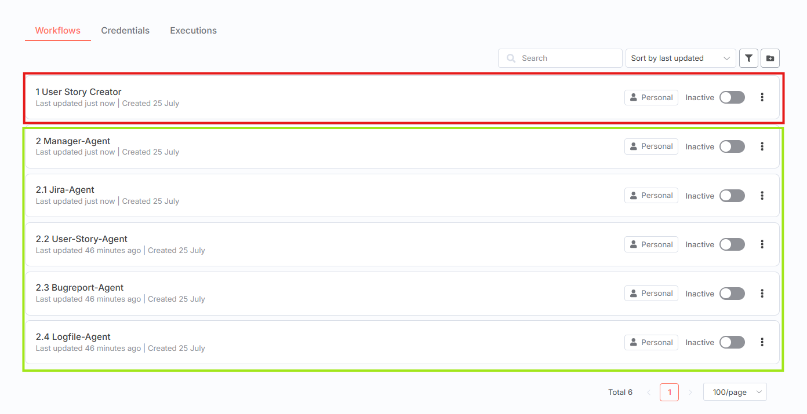
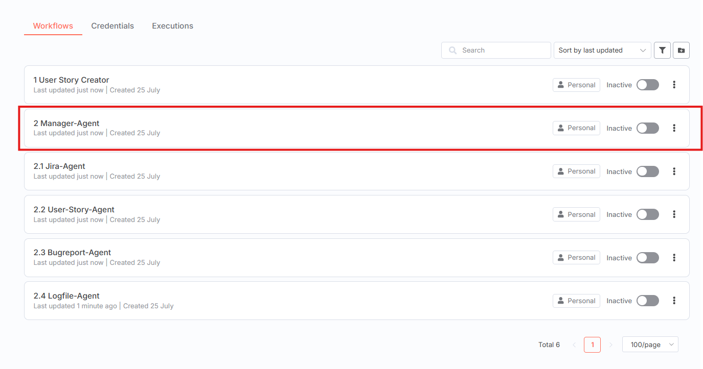

# Agent Garage: A GenAI Reference Architecture

**Agent Garage** is an open-source project aimed at building a reference architecture for a generative AI (GenAI) platform using open-source software. It is designed to serve as a starting point for creating agentic AI workflows and exploring modular, self-hosted AI solutions.

This platform is built to support **exploration**, **experimentation** and **development** with AI agents. It offers a practical environment for any user who wants to understand how intelligent AI-agents can be used to automate tasks, solve problems, or implement custom workflows. Whether you want to try out existing agents, adapt them to your needs, or build entirely new solutions, the agent garage provides a flexible and accessible starting point.

This project builds upon the foundation of the **Self-hosted AI Starter Kit**, curated by <https://github.com/n8n-io>, which combines the self-hosted n8n platform with a curated list of compatible AI products and components.


## Table of Contents

- [Key Features](#key-features)
- [Tech Stack](#tech-stack)
- [Installation](#installation)
- [Getting Started with the Agent Garage](#-getting-started-with-the-agent-garage)
- [Podman Compatibility](#-podman-compatibility)
- [CI/CD Pipeline](#-cicd-pipeline)
- [Notes](#-notes)
- [OpenWebUI and n8n Integration Architecture](#-openwebui-and-n8n-integration-architecture)
- [Chat-based Workflow Creation with n8n-MCP](#-chat-based-workflow-creation-with-n8n-mcp)
- [Upgrading](#upgrading)
- [Recommended Reading](#-recommended-reading)
- [Video Walkthrough](#-video-walkthrough)
- [More AI Templates](#️-more-ai-templates)
- [Tips & Tricks](#-tips--tricks)
- [License](#-license)

## ⚠️ Disclaimer

Just to reiterate the point from the license:
This project is provided on an "AS IS" BASIS, WITHOUT WARRANTIES OR CONDITIONS OF ANY KIND, either express or implied.

This project is provided as a **proof of concept** and is intended for **experimental
or educational purposes only**. It's maintained on best-effort basis. While it's
perfectly possible to use it as a base for an enterprise implementation, the project
"as is" is **not** suitable for production or mission-critical use. The maintainers do
not guarantee that the software functions as intended, nor do they assume responsibility
for any loss or damage resulting from its use.

Use of this project does not imply any affiliation with or endorsement by Accenture.

> [!NOTE]
> **Enterprise Version Available:** While this is a showcase lab environment, an enterprise implementation version has been successfully deployed with one of our clients and has been in production for years. This demonstrates that the concepts behind this solution are enterprise-ready.

## Key Features

🚗 **Agentic AI:** Build smart, autonomous agents effortlessly.

🧰 **Full-Stack:** Frontend, backend, databases and local LLM covered.

🛠️ **Modular:** Easily customizable, swap tools in and out.

📖 **Documentation & Demos:** Practical examples and docs to learn and accelerate client showcases.

🌐 **Open Source First:** 100% open-source tools, ready for enterprise adoption.

## Tech Stack

✅ [**Open WebUI**](https://openwebui.com/) - User-friendly AI interface

✅ [**Self-hosted n8n**](https://n8n.io/) - Low-code platform with over 400 integrations and advanced AI components

✅ [**vLLM**](https://docs.vllm.ai/) - High-performance LLM inference engine with OpenAI-compatible API

✅ [**Qdrant**](https://qdrant.tech/) - Open-source, high-performance vector store with a comprehensive API

✅ [**PostgreSQL**](https://www.postgresql.org/) - Reliable database system that handles large amounts of data safely

✅ [**pgAdmin**](https://www.pgadmin.org/) - Web-based PostgreSQL database management interface

## Installation

### Cloning the Repository

```bash
git clone https://github.com/twodigits/agent-garage.git
cd agent-garage
```

### Running the Multi-Container System

A container engine is required to run this multi-container system. Either Docker or Podman can be used. One of these must be selected prior to installation, as it serves as the foundational component for hosting the containers.

### Using Docker Compose

#### For Nvidia GPU Users

```bash
git clone https://github.com/twodigits/agent-garage.git
cd agent-garage
docker compose --profile gpu up
```

> [!NOTE]
> If you have not used your Nvidia GPU with Docker before, you may need to install
> [nvidia-container-toolkit](https://docs.nvidia.com/datacenter/cloud-native/container-toolkit/install-guide.html).

#### For CPU-Only Users

```bash
git clone https://github.com/twodigits/agent-garage.git
cd agent-garage
docker compose --profile cpu up
```

### Using Podman Compose

#### Install Podman Compose

```bash
pip install podman-compose
```

#### For GPU Users (Linux with NVIDIA)

```bash
git clone https://github.com/twodigits/agent-garage.git
cd agent-garage
podman-compose --profile gpu up -d
```

#### For CPU-Only Users

```bash
git clone https://github.com/twodigits/agent-garage.git
cd agent-garage
podman-compose --profile cpu up -d
```

> [!NOTE]
> For detailed Podman setup and configuration, see [PODMAN_MIGRATION.md](PODMAN_MIGRATION.md).

#### For Mac / Apple Silicon Users

If you're using a Mac with Apple Silicon, GPU acceleration is not available for container workloads. Use the CPU profile:

```bash
git clone https://github.com/twodigits/agent-garage.git
cd agent-garage
docker compose --profile cpu up
```


## 🚀 Getting Started with the Agent Garage

### Key Goals of the Platform

*  Use and interact with **preconfigured AI agents**

* Create your **own workflows** using modular components

* Get started quickly thanks to **labeled and guided workflows**

All workflows in n8n are clearly labeled and structured, making it easy to understand their purpose and discover how agents are connected.
The agent garage encourages to follow, explore, and build on the existing components.
This makes the platform an ideal starting point for working with agent-based automation, open-ended, guided, and ready for your own ideas.

The core of Agent Garage is a Docker Compose file, pre-configured with network and storage settings, minimizing the need for additional installations. After completing the installation steps above, follow these steps to get started.

### n8n

1. Navigate to http://localhost:5678
2. The Registration form will appear.
3. Enter the requested data. However, these do not have to be valid, as the e-mail address is not checked. You only have to set this up once.

   
4. The dashboard will be loaded.


### Open WebUI

1. Navigate to http://localhost:3000 .The Sign In page will appear: 

   

2. Use the following credentials to sign in:

   Email: admin@test.com

   Password: S2yjzup!3

3. After login, the chat interface is visible.

**Disclaimer:** Open WebUI is still under active development and is intended for experimentation and testing only. It is not recommended for production use. You may occasionally experience display delays within the Open WebUI interface. In this case, reloading the page or waiting a few seconds will usually solve the problem.

### Further steps
When opening the n8n interface, you’ll see an overview of all available workflows .



There are two main categories of workflows:

🟥 **Simple Entry Workflow**

The User Story Creator workflow is highlighted with a red border.

It represents the simplest entry point into the system and is ideal for getting started.
This workflow is based on a single AI agent and lets you directly try out user story generation.
We recommend starting with this workflow to explore the basics before diving into the full multi-agent architecture.

🟩 **Multi-Agent System Workflows**

Workflows belonging to the multi-agent system are marked with a green border. The structure follows a clear hierarchy:

* The Manager-Agent is labeled with the number 2.

* The connected sub-agents are numbered 2.1 to 2.4, each handling a specific task (e.g. log analysis, bug reporting, Jira interaction, user story generation).

* These workflows belong together and operate as a collaborative system coordinated by the Manager-Agent.

---
### 1. Simple Workflow – *User Story Creator*

For an easy first step, use the **User Story Creator** workflow in **n8n**. This workflow is designed to explore the basic functionality and interaction with the chat interface of **Open WebUI**.
- 🔧 **Technically**, the workflow is based on a single AI-Agent that creates structured User Stories.

- ✅ **Goal**: Get quick results & understand the platform basics  
### How it works:  
  1. Double click on the User Story Creator workflow 

      
  2. Take a moment to review the explanations in the workflow and explore AI agents in n8n.
  3. Activate the workflow by clicking the Active Button:

      
  4. In the chat interface of **Open WebUI** , select the **User Story Creator** chat from the list:

      

  5. Enter a request (e.g. “Create a user story for a login function”)  via the chat interface and start interacting with the User Story Creator!
  
This entry point is ideal for getting familiar with the **core concepts** of the platform and testing your own ideas.

### 2. Next Level: Multi-Agent System with Supervisor Architecture

For the next step, use the **Multi-Agent System** workflow in **n8n**. This workflow is designed to demonstrate how multiple specialized AI agents collaborate under a supervisor architecture to handle selected tasks from the software development process.
 It consists of several specialized AI agents that work together to solve more complex tasks related to selected aspects of the software development process.

- 👥 Agents are clearly separated and each focuses on a specific task within the software development process.  
- 🧠 The **Supervisor Architecture** ensures that a central agent (Manager-Agent) coordinates workflows and distributes tasks  

- 🔧 **Technically**, the workflow is coordinated by a central **Manager-Agent**, which delegates tasks to other specialized agents ( User-Story-Agent, Logfile-Agent, Bugreport-Agent, Jira-Agent).

- ✅ **Goal**: Understand agent collaboration 

### How it works:  
  1. Double click on the **Manager-Agent** workflow

      
  2. Take a moment to review the explanations in the workflow and explore how the Manager-Agent and the other AI agents interact in **n8n**.  
  3. Activate the workflow by clicking the Active Button:

      
  4. In the chat interface of **Open WebUI**, select the chat named **SDLC Agents**: 

      
  5. Enter a request (e.g. “Analyze this log file and create a bug report”) via the chat interface. The Manager-Agent will automatically coordinate the involved agents and return the result to you.

### Overview: Specialized Agents in the Multi-Agent System

| Agent Name         | Responsibility                                         | Input / Artifacts | Output / Artifacts |
|--------------------|--------------------------------------------------------|-------------------|--------------------|
| **Jira-Agent**      | - Creating, searching, and updating tickets        |      - Ticket change <br>     - Search request for ticket <br>   - Ticket description     |  - Correctly modified data in Jira                  |
| **Logfile-Agent**   | - Analysis of logfiles for critical bugs and stack traces    |   -Logfile                 |          - Detailed analysis of bugs (error description, cause of error, etc.)          |
| **Bugreport-Agent** | - Generating structured bug reports based on analysis      |      - Detailed description of a bug             |       - Bugreport             |
| **User-Story-Agent**| - Generating structured user stories from requests         |       - Idea for software feature            |       - User story             |


## 🐳 Podman Compatibility

**Agent Garage is now fully compatible with both Docker Compose and Podman Compose!**

### Key Changes for Podman

- **Replaced Ollama with vLLM**: Now using vLLM for LLM inference with OpenAI-compatible API
  - `vllm-cpu` profile: CPU-only inference
  - `vllm-gpu` profile: GPU-accelerated inference (NVIDIA)
- **Folder-based storage**: All data stored in `./data/` directory instead of named volumes
- **Inline environment variables**: No `.env` file dependency
- **Added pgAdmin**: Database management interface on port 5050

### Running with Podman

```bash
# Install podman-compose
pip install podman-compose

# Start with CPU profile
podman-compose --profile cpu up -d

# Start with GPU profile
podman-compose --profile gpu up -d
```

For detailed migration information, see [PODMAN_MIGRATION.md](PODMAN_MIGRATION.md).

## 🔄 CI/CD Pipeline

This repository includes comprehensive GitHub Actions workflows to ensure compatibility and quality:

### Automated Testing

- **Lint and Validate**: YAML, Dockerfile, shell script, and markdown validation
- **Docker Tests**: Full integration testing with Docker Compose
- **Podman Tests**: Complete compatibility testing with Podman Compose
- **Security Scans**: Trivy vulnerability scanning on all configurations

### Workflow Triggers

All workflows run on:
- Push to `main`, `develop`, or `claude/**` branches
- Pull requests to `main` or `develop`

### What's Tested

✅ Image builds (Docker & Podman)
✅ Service startup and health checks
✅ PostgreSQL connectivity
✅ Qdrant vector database
✅ Security vulnerabilities
✅ Configuration validation

For detailed CI/CD documentation, see [.github/CI_README.md](.github/CI_README.md).

## 💡 Notes

### Default Model
The default vLLM model is `facebook/opt-125m` (lightweight for testing). You can use different LLMs by changing the model name in the `docker-compose.yml` file:

```yaml
vllm-cpu:  # or vllm-gpu
  command:
    - "--model"
    - "meta-llama/Llama-2-7b-hf"  # Change this to your preferred model
    - "--host"
    - "0.0.0.0"
    - "--port"
    - "8000"
```

To apply changes, restart the containers:
```bash
podman-compose down
podman-compose --profile cpu up -d
```

### Change logfile
The **Logfile Agent** can access log files from the `./logs` directory mounted in n8n.
To analyze different log files, place them in the `./logs` directory and update the file path in the **n8n workflow** of the Logfile Agent.


### Setting up Jira to use the Jira-Agent

1. Navigate to http://localhost:8080
2. The Jira-Setup page will be visible


3. Click on "I'll set it up myself" and continue.

4. Choose "Built In Database".


5. The application properties can be adopted by default.

6. The next step is to generate a Server ID, which is required to use Jira. In addition, a Jira license must be available to which the Server ID is linked. If the license is not available, click on the “Generate a new trial license” for jira Software (Data Center) with the link below.


7. Now, Jira can be configured and projects can be set up. Note that only “tasks” exist as issue types in the jira version. The issue types "Story" and "Bug" must first be configured.
Click on Settings at the top right of your profile, select Issues from the menu and configure the issue types Story and Bug as shown in the image.


8. In order to link Jira with the n8n workflows, adapt the `.env` file.

### Create and configure personal access tokens
1. Log in to your profile and open Settings.

2. Select Personal Access Tokens in the left sidebar.

3. Click on Create new token to create a token.

4. Copy the generated token and paste it into the `.env` file:

   JIRA_PERSONAL_TOKEN=your_token


### Create project and store metadata
1. Create a new repository or project in your GitHub organization or user account.

2. Enter the following information in the .env file:

   JIRA_USERNAME=your_username

   JIRA_PROJECT=project_key

## 🔗 OpenWebUI and n8n Integration Architecture

### Platform Architecture

The platform leverages containerization technology, where each component runs in its own container connected through a shared virtual network. This architecture provides:
- Hardware independence and platform portability
- Low entry barrier for new users
- Simplified deployment with minimal setup steps

### How the Integration Works

#### Communication Flow

1. **User Input**: Users interact with the platform through OpenWebUI's chat interface, submitting requests for AI agent processing

2. **n8n-Pipe Function**: OpenWebUI uses a custom Python function called "n8n-pipe" to bridge communication with n8n:
   - Intercepts user messages instead of sending them directly to an AI model
   - Forwards requests to n8n workflows via webhooks
   - Maintains session management for continuous conversations

3. **Webhook Trigger**: n8n receives the message through a webhook endpoint, which triggers the appropriate workflow containing the MAS implementation

4. **Agent Processing**: Within n8n workflows:
   - AI agents access Large Language Models (LLMs) through Ollama
   - Agents can interact with external systems (e.g., Jira) via MCP clients
   - Multiple specialized agents collaborate to process the request

5. **Response Delivery**: The generated response is sent back to OpenWebUI via webhook, where it's formatted with features like:
   - Markdown rendering
   - Code syntax highlighting
   - Structured message display

### The n8n-Pipe Function

The n8n-pipe is a Python function that bridges OpenWebUI with n8n workflows. Key features include:

- **Webhook Configuration**: Configurable n8n webhook URL and bearer token authentication
- **Field Mapping**: Customizable input and output field names for data exchange
- **Status Indicators**: Real-time status emissions to show workflow progress
- **Session Management**: Maintains session IDs for conversation continuity
- **Error Handling**: Comprehensive error catching and reporting

### Integration with External Systems

The platform extends existing tools rather than replacing them. Through n8n's extensive node library and MCP support, AI agents can:

- Retrieve information from connected systems
- Update data in external tools
- Create new entries (e.g., Jira tickets)
- Reduce manual data entry through automation

### Technical Considerations

While the current implementation demonstrates technical feasibility and serves as an excellent proof of concept, please note:
- This is designed for experimentation and educational purposes
- Security, scalability, and reliability aspects would need enhancement for production use
- The underlying concept can be adapted for enterprise-ready solutions

## 🤖 Chat-based Workflow Creation with n8n-MCP

Agent Garage becomes even more powerful with the n8n-MCP (Model Context Protocol) Server! This enables you to create n8n workflows directly through chat interactions in AI development environments like Claude, Windsurf, or Cursor - without having to dig through the complete n8n documentation.

### What is n8n-MCP?

The n8n-MCP Server gives AI assistants comprehensive access to n8n node documentation and enables:
- Chat-based workflow creation without deep n8n knowledge
- Smart node search and suggestions
- Validation of node configurations before deployment
- Access to more than 500 n8n nodes with extensive property coverage

### Quick Start

1. **Installation via npx (recommended):**
   ```bash
   npx n8n-mcp
   ```

2. **Configure in your AI development environment:**
   - Add the MCP server to your Claude/Cursor/Windsurf configuration
   - Start a new chat and describe your desired workflow

3. **Create workflows:**
   Simply describe in chat what you want to automate:
   ```
   "Create a workflow that daily fetches emails from Gmail, 
   saves attachments to Google Drive, and sends a Slack notification"
   ```

### Benefits for Agent Garage Users

- **No n8n expertise required:** The AI assistant translates your requirements into working workflows
- **Faster development:** From idea to workflow in minutes instead of hours
- **Error reduction:** Automatic validation of node configurations

For more details and complete documentation, visit the [n8n-MCP Repository](https://github.com/czlonkowski/n8n-mcp).


## Upgrading

### For Nvidia GPU Setups

```bash
docker compose --profile gpu-nvidia pull
docker compose create && docker compose --profile gpu-nvidia up
```

### For Mac / Apple Silicon Users

```
docker compose pull
docker compose create && docker compose up
```

### For Non-GPU Setups (CPU Only)

```bash
docker compose --profile cpu pull
docker compose create && docker compose --profile cpu up
```

## 👓 Recommended Reading

n8n is full of useful content for getting started quickly with its AI concepts and nodes.

- [AI agents for developers: from theory to practice with n8n](https://blog.n8n.io/ai-agents/)
- [Tutorial: Build an AI workflow in n8n](https://docs.n8n.io/advanced-ai/intro-tutorial/)
- [Langchain Concepts in n8n](https://docs.n8n.io/advanced-ai/langchain/langchain-n8n/)
- [Demonstration of key differences between agents and chains](https://docs.n8n.io/advanced-ai/examples/agent-chain-comparison/)
- [What are vector databases?](https://docs.n8n.io/advanced-ai/examples/understand-vector-databases/)

## 🎥 Video Walkthrough

- [Installing and using Local AI for n8n](https://www.youtube.com/watch?v=xz_X2N-hPg0)

## 🛍️ More AI Templates

For more AI workflow ideas, visit the [**official n8n AI template
gallery**](https://n8n.io/workflows/?categories=AI). From each workflow,
select the **Use workflow** button to automatically import the workflow into
your local n8n instance.

### Learn AI Key Concepts

- [AI Agent Chat](https://n8n.io/workflows/1954-ai-agent-chat/)
- [AI chat with any data source (using the n8n workflow too)](https://n8n.io/workflows/2026-ai-chat-with-any-data-source-using-the-n8n-workflow-tool/)
- [Chat with OpenAI Assistant (by adding a memory)](https://n8n.io/workflows/2098-chat-with-openai-assistant-by-adding-a-memory/)
- [Use an open-source LLM (via Hugging Face)](https://n8n.io/workflows/1980-use-an-open-source-llm-via-huggingface/)
- [Chat with PDF docs using AI (quoting sources)](https://n8n.io/workflows/2165-chat-with-pdf-docs-using-ai-quoting-sources/)
- [AI agent that can scrape webpages](https://n8n.io/workflows/2006-ai-agent-that-can-scrape-webpages/)

### Local AI Templates

- [Tax Code Assistant](https://n8n.io/workflows/2341-build-a-tax-code-assistant-with-qdrant-mistralai-and-openai/)
- [Breakdown Documents into Study Notes with MistralAI and Qdrant](https://n8n.io/workflows/2339-breakdown-documents-into-study-notes-using-templating-mistralai-and-qdrant/)
- [Financial Documents Assistant using Qdrant and](https://n8n.io/workflows/2335-build-a-financial-documents-assistant-using-qdrant-and-mistralai/) [Mistral.ai](http://mistral.ai/)
- [Recipe Recommendations with Qdrant and Mistral](https://n8n.io/workflows/2333-recipe-recommendations-with-qdrant-and-mistral/)

## 💡 Tips & Tricks

### Accessing Local Files

Agent Garage will create a shared folder (by default, located in the same directory) which is mounted to the n8n container and allows n8n to access files on disk. This folder within the n8n container is
located at `/data/shared` -- this is the path you’ll need to use in nodes that
interact with the local filesystem.

**Nodes that interact with the local filesystem:**

- [Read/Write Files from Disk](https://docs.n8n.io/integrations/builtin/core-nodes/n8n-nodes-base.filesreadwrite/)
- [Local File Trigger](https://docs.n8n.io/integrations/builtin/core-nodes/n8n-nodes-base.localfiletrigger/)
- [Execute Command](https://docs.n8n.io/integrations/builtin/core-nodes/n8n-nodes-base.executecommand/)

> [!NOTE]
> This starter kit is designed to help you get started with self-hosted AI
> workflows. While it’s not fully optimized for production environments, it
> combines robust components that work well together for proof-of-concept
> projects. You can customize it to meet your specific needs


## 📜 License

This project is [licensed under the Apache 2.0 license](LICENSE).
